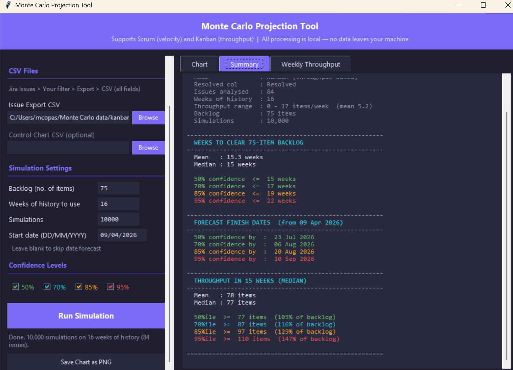

# Monte Carlo Projection Tool for Jira

A lightweight, local Monte Carlo simulation tool for agile teams using Jira. Produces probabilistic forecasts for backlog completion — with confidence-level date projections — using your team's own historical data exported directly from Jira.

**No cloud. No accounts. No data leaves your machine.**



---

## Why This Tool?

Most agile forecasting tools either require cloud access, send your data to a third-party service, or are buried inside expensive portfolio management platforms. This tool runs entirely on your local machine using CSV exports from Jira — making it safe to use with sensitive or proprietary project data on corporate networks.

---

## What It Does

- Runs 10,000 Monte Carlo simulations (configurable) against your historical Jira data
- Forecasts how many weeks are needed to clear a backlog at multiple confidence levels
- Applies a **capacity adjustment** to account for meetings, holidays, and overhead
- Calculates forecast finish **dates** from a given start date
- Displays a weekly throughput breakdown
- Exports results as a **PNG chart**, **HTML report**, or **PDF report**

---

## Platform Support

| Platform | Supported |
|----------|-----------|
| Windows  | ✅ |
| macOS    | ✅ |
| Linux    | ✅ |

---

## Running the Tool

### Windows — Run from Source

1. Install Python 3.7 or higher from [python.org](https://python.org/downloads)

> During installation, tick **"Add Python to PATH"** before clicking Install.

2. Install the required packages:

```
pip install pandas numpy matplotlib
```

If you are on a corporate network with SSL inspection, use:

```
pip install pandas numpy matplotlib --trusted-host pypi.org --trusted-host files.pythonhosted.org --user
```

3. Run the tool:

```
python monte_carlo_jira.py
```

### macOS — Launcher Script

1. Download `monte_carlo_jira.py` and `launch_monte_carlo.command` into the same folder
2. Install dependencies (one-time setup):

```
brew install python@3.12 python-tk@3.12
/opt/homebrew/bin/python3.12 -m venv ~/monte_carlo_env
source ~/monte_carlo_env/bin/activate
pip install pandas numpy matplotlib
```

3. Make the launcher executable (one-time setup):

```
chmod +x /path/to/launch_monte_carlo.command
```

4. Double-click `launch_monte_carlo.command` in Finder to launch the app

> If Homebrew is not installed, run this first:
> ```
> /bin/bash -c "$(curl -fsSL https://raw.githubusercontent.com/Homebrew/install/HEAD/install.sh)"
> ```

### Linux — Run from Source

```
pip3 install pandas numpy matplotlib
python3 monte_carlo_jira.py
```

---

## Exporting Data from Jira

### Issue Export CSV

1. Go to **Issues** → **Search for Issues** (or use an existing filter)
2. Filter for your team's completed issues over the last 12–16 weeks, for example:
   ```
   project = "YOUR PROJECT" AND statusCategory = Done AND resolved >= -16w ORDER BY resolved ASC
   ```
3. Click **Export** → **Export Excel CSV (all fields)**
4. Save the CSV file

The tool reads the **Resolved** date column and calculates weekly throughput automatically.

### Control Chart CSV (optional)

1. Go to your Jira board
2. Click **Reports** → **Control Chart**
3. Click **Export**
4. Save the CSV file

If provided, the tool will add cycle time percentile statistics to the summary.

---

## Usage

1. Launch the tool using the appropriate method for your platform
2. Browse to your **Issue Export CSV**
3. Set your **backlog size** (number of items)
4. Set your **weeks of history** to use (default 16)
5. Set your **start date** for the forecast (defaults to today)
6. Set your **team availability %** (default 80% — see below)
7. Click **Run Simulation**

Results appear across three tabs:

- **Chart** — distribution histograms with confidence band overlays
- **Summary** — full numeric breakdown including forecast finish dates
- **Weekly Throughput** — week-by-week item count with visual bar

After running, three export options appear at the bottom of the left panel:

- **Save Chart as PNG** — exports the chart image
- **Export Report as HTML** — single self-contained file with chart, summary, and throughput breakdown; opens in any browser and is easily emailed
- **Export Report as PDF** — three-page PDF with chart, summary, and throughput breakdown; no additional dependencies required

---

## Capacity Adjustment

The **Team availability %** field scales the historical throughput before simulation to reflect realistic team capacity. The default is **80%**, which is the standard agile recommendation accounting for meetings, ceremonies, holidays, and general overhead.

| Setting | Use case |
|---------|----------|
| 100% | No adjustment — raw historical throughput only |
| 80% | Standard recommendation for most teams |
| 70% | High-overhead periods (e.g. PI planning, major releases) |
| 60% | Significant planned absence or reduced team size |

This is intentionally kept simple — a single percentage applied across the forecast horizon. A consistent availability assumption is more useful and more honest than attempting to model individual holidays or sick days, which cannot be predicted.

---

## Understanding the Results

### Confidence levels

| Level | Meaning |
|-------|---------|
| 50% | Half of all simulations finished by this point. Optimistic estimate. |
| 70% | A reasonable working estimate. |
| 85% | A safe commitment for most stakeholder conversations. |
| 95% | Near-certain. Use for hard deadlines or release planning. |

### Weeks chart (left)

Shows how many weeks were needed across all simulations. A wider distribution means more variability in your historical throughput.

### Throughput chart (right)

Shows how many items were completed in the median number of weeks. The `>=` figures are **lower bounds** — in X% of simulations, the team completed *at least* that many items.

### Why the 95% throughput figure is higher than the 50%

The throughput chart asks *"how much will we complete?"* — so higher is better. This is the opposite direction to the weeks chart, which asks *"how long will it take?"* where lower is better.

### A note on accuracy

Monte Carlo simulation produces a probability distribution, not a precise prediction. The results reflect the range of outcomes that history suggests are plausible. The 85% confidence level is generally appropriate for stakeholder conversations; the 95% level for hard external deadlines.

---

## Changelog

| Version | Changes |
|---------|---------|
| v2.4 | Capacity adjustment (%), HTML report export, PDF report export |
| v2.3 | Cross-platform button fix for macOS compatibility |
| v2.2 | Forecast finish dates, scrollable left panel |
| v2.1 | Kanban throughput mode, weekly throughput tab |
| v2.0 | GUI with tkinter |

---

## Tips

- **Minimum history**: At least 5–6 weeks of data for meaningful results. 10–16 is better.
- **Zero weeks**: Weeks with zero completions are included in the simulation — they widen the upper confidence bands, which is appropriate.
- **Mean vs median gap**: A large gap indicates spike-and-drought flow patterns — worth addressing as a flow improvement.
- **Capacity default**: The 80% default is a planning assumption. Adjust it to reflect your team's actual situation.

---

## Licence

MIT Licence — free to use, adapt, and distribute. See [LICENSE](LICENSE) for details.

---

## Contributing

Issues and pull requests welcome. If your Jira export uses column names not automatically detected by the tool, please open an issue with the column headers and they will be added to the auto-detection logic.
